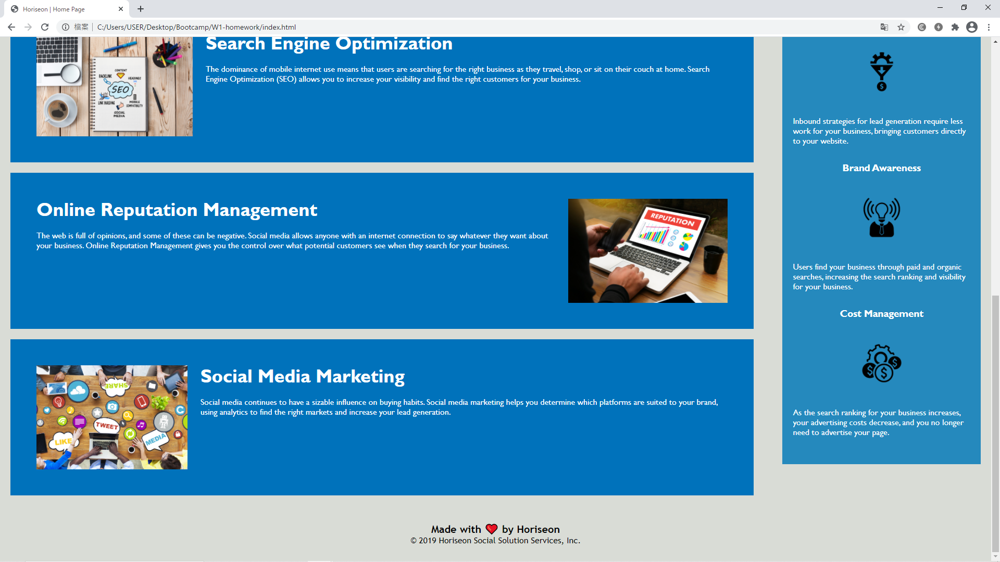

# W1-homework
This is a homework for Bootcamp Week 1. Created and committed by Yuk Hung Ronald Wong

## Purpose & Sceneario
The purpose of this homework is to creata a landing page for an marketing agency.

## Changes made
* Title
``` 
Title changed from "website" to "Horiseon | Home Page"
```
* Elements
```
non-semantic elements of 
<div> & <ul><li> 
```
```
changed to semantic elements of
 <section> & <nav><section>
 (so as in the relative css attribute or classes)
```
* Alternative text for images
```
Alternative text are added in all six images in use
```
```
from

to

```
```
alternative text for background image are added through
<section class="" role="img" title="the alternative text">
```


## Tags & Syntax(es) & attributes being used
```
<section></section>
<nav></nav>
```
```
alt=""
role="img"
title=""

```
## Quick Preview of the outcome


